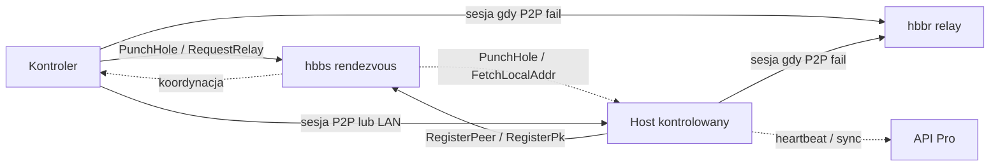
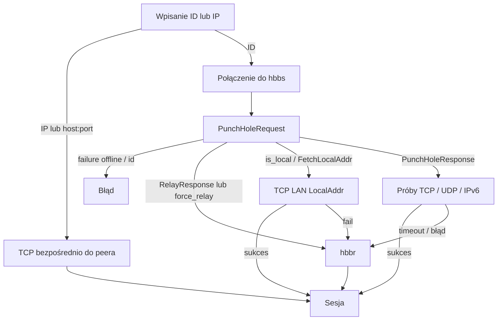

# Mechanizmy łączności klienta (BetterDesk / RustDesk)

Dokument opisuje, **jak klient się łączy**: do jakich hostów, w jakiej kolejności, kiedy ruch idzie P2P / LAN / relay, oraz gdzie to znaleźć w kodzie.

Zakres: koordynacja sesji (rendezvous, relay, bezpośrednie połączenia, API).  
Poza zakresem: protokół video/audio po `LoginRequest`, instalacja `rustdesk-server`.

---

## 1. Model ogólny

Klient **nie jest „klientem jednego serwera WWW”**. Utrzymuje długotrwałą rejestrację na **serwerze rendezvous (hbbs)** i — przy połączeniu po ID — używa hbbs tylko do **koordynacji**. Ruch sesji (ekran, wejście, pliki) idzie:

- **bezpośrednio do peera** (P2P TCP/UDP/IPv6), albo
- **przez relay (hbbr)**, albo
- **bez hbbs** (połączenie po IP / `host:port`).

Dodatkowo klient może kontaktować się z **API** (Pro / admin) — to osobny kanał HTTP(S), nie ścieżka mediów RDP.

Domyślny publiczny rendezvous **jest wyłączony** w oficjalnym kliencie BetterDesk  
(`RENDEZVOUS_SERVERS` jest puste w [`libs/hbb_common/src/config.rs`](../libs/hbb_common/src/config.rs)).  
Bez `custom-rendezvous-server` / `custom.txt` / deploy string klient **nie** łączy się z `*.rustdesk.com`.  
Szczegóły: [OFFICIAL_CLIENT.md](OFFICIAL_CLIENT.md).

---

## 2. Role endpointów i porty

Stałe w [`libs/hbb_common/src/config.rs`](../libs/hbb_common/src/config.rs):

| Rola | Typowy komponent | Port | Opis |
|------|------------------|------|------|
| Rendezvous / ID | `hbbs` | **21116** (`RENDEZVOUS_PORT`) | Rejestracja ID, hole-punching, wskazanie peera i relay |
| Relay | `hbbr` | **21117** (`RELAY_PORT`) | Proxy ruchu, gdy P2P się nie uda |
| WebSocket rendezvous | ten sam hbbs | **21118** (`WS_RENDEZVOUS_PORT`) | Transport WS do hbbs |
| WebSocket relay | ten sam hbbr | **21119** (`WS_RELAY_PORT`) | Transport WS do hbbr |
| API | Pro / admin | zwykle **21114** (BetterDesk Go) | Heartbeat, sync, deploy — **nie** media sesji |
| Direct listener | lokalny klient | **21118** (`RENDEZVOUS_PORT + 2`) | Wejście TCP po IP (bez hbbs) |
| LAN discovery | lokalny klient | **21119** (`RENDEZVOUS_PORT + 3`) | UDP broadcast `PeerDiscovery` |

Uwaga: porty **21118** i **21119** służą w dwóch kontekstach (WS do serwerów vs lokalny direct/LAN). Rozróżnia je to, **czy** połączenie idzie do hosta peera, czy do skonfigurowanego serwera z mapowaniem WS (`libs/hbb_common/src/websocket.rs`).

Klucz weryfikacji peerów: opcja `key` (BetterDesk `id_ed25519.pub`). Brak publicznego `RS_PUB_KEY` jako fallbacku.

---

## 3. Publiczne vs self-hosted (BetterDesk)

| Aspekt | Bez konfiguracji (BetterDesk) | Po wpisaniu serwera |
|--------|------------------------------|---------------------|
| Rendezvous | **brak** (fail-closed) | opcja `custom-rendezvous-server` |
| Relay | — | `relay-server` lub host+1 |
| API | **brak** (nie `admin.rustdesk.com`) | `api-server` albo wyliczenie `host:21114` |
| Sync / heartbeat HTTP | wyłączony (pusty API) | aktywny wobec BetterDesk API |
| UDP / IPv6 punch (domyślnie) | — | jak dla non-public (`N` gdy nie `*.rustdesk.com`) |

`using_public_server()` ([`src/common.rs`](../src/common.rs)) nadal oznacza „brak custom rendezvous”, ale **nie** powoduje ruchu do rustdesk.com.

`is_public(url)` uznaje hosty `rustdesk.com` oraz `*.rustdesk.com`.

---

## 4. Skąd klient bierze adresy serwerów

### 4.1. Aktywny rendezvous — `Config::get_rendezvous_server()`

Priorytet ([`libs/hbb_common/src/config.rs`](../libs/hbb_common/src/config.rs)):

1. `EXE_RENDEZVOUS_SERVER` — osadzone w nazwie exe / licencji (Windows)
2. opcja `custom-rendezvous-server`
3. `PROD_RENDEZVOUS_SERVER` — override compile/runtime
4. `Config2.rendezvous_server` — zapisany najszybszy host (latency)
5. pierwszy z `get_rendezvous_servers()`

Bez portu dopisywany jest `:21116`.

### 4.2. Lista — `Config::get_rendezvous_servers()`

1. EXE → pojedynczy host  
2. `custom-rendezvous-server` → pojedynczy  
3. `PROD_RENDEZVOUS_SERVER` → pojedynczy  
4. jeśli `Config2.serial > SERIAL`: opcja `rendezvous-servers` (lista CSV, hosty z `.`)  
5. wbudowane `RENDEZVOUS_SERVERS` — **puste** w BetterDesk (brak publicznego fallbacku)

Serwer może wypchnąć nową listę komunikatem `ConfigUpdate` / `ConfigureUpdate` (`rendezvous_servers` + `serial`). Host-side mediator wtedy restartuje się ([`src/rendezvous_mediator.rs`](../src/rendezvous_mediator.rs)).

Na desktopie UI/proces łączący się wychodząco bierze adres przez IPC: `crate::get_rendezvous_server()` → `ipc::get_rendezvous_server` ([`src/common.rs`](../src/common.rs), [`src/ipc.rs`](../src/ipc.rs)).

### 4.3. Relay — `RendezvousMediator::get_relay_server`

1. opcja `relay-server`  
2. wartość przekazana przez hbbs w PunchHole / FetchLocalAddr  
3. fallback: ten sam host co aktywny rendezvous, port **+1** (`increase_port`)

Kontroler łączący się do relay używa `check_port(..., RELAY_PORT)` → **21117**.

### 4.4. API — `get_api_server()`

1. licencja Windows (`lic.api`), jeśli obecna  
2. jawna opcja `api-server`  
3. z custom rendezvous: host z portem **−2** (21114) jako `http://…`  
4. domyślnie **pusty string** (BetterDesk nie używa `admin.rustdesk.com`)

---

## 5. Strona hosta (kontrolowany)

Wejście: `RendezvousMediator::start_all()` w [`src/rendezvous_mediator.rs`](../src/rendezvous_mediator.rs).

### 5.1. Start

1. `test_nat_type()` — klasyfikacja NAT (asymetryczny / symetryczny).  
2. Przy `outgoing-only` — pętla bez rejestracji (brak przyjmowania).  
3. `hbbs_http::sync::start()` — wątek sync/API.  
4. `direct_server()` — opcjonalny listener TCP na porcie direct (domyślnie 21118), sterowany opcją `direct-server`.  
5. `lan::start_listening()` — discovery UDP (na desktopie gdy zainstalowany; zawsze na Android).  
6. Dla **każdego** hosta z `get_rendezvous_servers()`: `RendezvousMediator::start(server, host)`.

Komentarz w kodzie: wieloserwerowy rendezvous dla połączeń wychodzących jest w praktyce **przestarzały**; host nadal może utrzymywać mediatory do listy hostów.

### 5.2. UDP vs TCP do hbbs

`start()` wybiera:

- **TCP** (lub WS przez `connect_tcp` + mapowanie portów), gdy: proxy SOCKS, `allow-websocket` (`use_ws()`), albo `disable-udp`;
- w przeciwnym razie **UDP** na `:21116`.

### 5.3. Rejestracja

- `RegisterPeer` — okresowa rejestracja ID + `serial`.  
- `RegisterPk` — rejestracja klucza publicznego / UUID; odpowiedzi m.in. `OK`, `UUID_MISMATCH`, `NOT_DEPLOYED`.  
- Latency aktualizowana w `Config::update_latency` → wybór „najszybszego” serwera.

### 5.4. Komunikaty przychodzące od hbbs

| Message | Handler | Skutek |
|---------|---------|--------|
| `PunchHole` | `handle_punch_hole` | Punch TCP/UDP do kontrolera albo od razu relay |
| `RequestRelay` | `handle_request_relay` | Połączenie do hbbr z UUID |
| `FetchLocalAddr` | `handle_intranet` | Odpowiedź `LocalAddr` (LAN) lub fallback relay |
| `ConfigureUpdate` | inline | Nowa lista `rendezvous-servers` + ewentualny restart |

W `handle_punch_hole` **od razu relay**, gdy:

- NAT kontrolera lub hosta = `SYMMETRIC`, albo  
- `use_ws()` / proxy / `force_relay`, albo  
- wyłączony TCP listen i brak UDP punch (`udp_port <= 0`).

Inaczej: punch UDP (gdy `udp_port > 0`) lub punch TCP (krótki connect z tego samego `local_addr` do peera, potem `PunchHoleSent` i `accept_connection`).

---

## 6. Strona kontrolera (wychodzący)

Wejście: `Client::start` → `_start_inner` w [`src/client.rs`](../src/client.rs).

### 6.1. Ścieżki bez rendezvous

| Wejście użytkownika | Zachowanie |
|---------------------|------------|
| Czysty adres IP | `connect_tcp_local` na port **21118** (`RELAY_PORT + 1`) — **bez hbbs** |
| `host:port` (domena z portem) | bezpośredni TCP na ten adres — **bez hbbs** |

Wymaga, by po stronie peera działał `direct_server` (opcja `direct-server`).

### 6.2. Połączenie po ID

1. Wybór hbbs: `get_rendezvous_server(1000)` albo `other_server` (patrz niżej).  
2. Opcjonalny test UDP NAT / IPv6 punch (`enable-udp-punch` / `enable-ipv6-punch`).  
3. TCP (lub WS) do hbbs `:21116`.  
4. Opcjonalnie `secure_tcp` / `KeyExchange`, gdy jest klucz + token / switch code.  
5. Wysyłka `PunchHoleRequest` (ID peera, NAT, `udp_port`, `force_relay`, IPv6, typ połączenia…).  
6. Odpowiedź:
   - `PunchHoleResponse` → adres peera (zmanglowany), `pk`, `relay_server`, `is_local` / `nat_type`, flagi UDP/IPv6;  
   - `RelayResponse` → od razu ścieżka relay (`create_relay`).  
7. `Client::connect()` — równoległe próby TCP (+ UDP/IPv6), potem przy porażce lub `force_relay`: `request_relay()`.  
8. `secure_connection()` — weryfikacja PK podpisanego przez klucz rendezvous (opcja `key`; brak publicznego fallbacku).  
9. `LoginRequest` i dalsza sesja (poza zakresem tego dokumentu).

### 6.3. Relay po stronie kontrolera

`request_relay()` (do 3 prób):

1. Nowe TCP do **hbbs**.  
2. `RequestRelay` z UUID.  
3. Po `RelayResponse`: `create_relay()` — TCP do **hbbr:21117**, ponownie `RequestRelay` z tym samym UUID (parowanie stron).

### 6.4. Peer na innym serwerze (`id@server`)

W `LoginConfigHandler::initialize`: ID postaci `peer@server` lub `peer@public` ustawia `other_server`.  
`_start_inner` wtedy łączy się do wskazanego rendezvous zamiast lokalnej konfiguracji (`PUBLIC_SERVER` = wbudowany publiczny host).

---

## 7. Drzewo decyzji: P2P vs LAN vs relay

Skrót reguł:

| Warunek | Preferowana ścieżka |
|---------|---------------------|
| IP / `host:port` | Direct, bez hbbs |
| `force-always-relay` / `force_relay` / WebSocket / SOCKS proxy | Relay |
| NAT `SYMMETRIC` (którykolwiek bok) | Relay (host często od razu; kontroler skraca timeout P2P) |
| `is_local` / intranet (`FetchLocalAddr`) | LAN TCP; przy niepowodzeniu relay |
| Oba NAT asymetryczne, punch OK | P2P |
| Punch fail, jest `relay_server` | Relay |

Timeouty P2P w `Client::connect()` zależą od `is_local`, typów NAT i historii `direct_failures`.

---

## 8. Transport

### 8.1. Do rendezvous / relay

| Tryb | Kiedy | Porty |
|------|-------|-------|
| UDP | Domyślnie (host mediator), brak proxy/WS/`disable-udp` | 21116 |
| TCP | Proxy, `disable-udp`, część ścieżek kontrolera | 21116 / 21117 |
| WebSocket | `allow-websocket` (`use_ws()`) | mapowanie na 21118 / 21119 |

`connect_tcp` przechodzi przez warstwę, która przy `use_ws()` mapuje porty rendezvous/relay na WS ([`libs/hbb_common/src/websocket.rs`](../libs/hbb_common/src/websocket.rs)). Przy WS host traktuje punch jak sytuację „idź w relay” (`use_ws() || is_proxy()`).

### 8.2. Proxy SOCKS5

`Config::get_socks()` / `Config::is_proxy()` — gdy ustawiony proxy, mediator używa TCP, a punch/intranet często kończy się relayem (lokalny adres za proxy jest bezużyteczny do hole-punchingu).

### 8.3. Sesja po zestaleniu

Po udanym P2P/relay strumień to `Stream` (TCP lub KCP nad UDP przy udanym UDP punch). Dalszy protokół aplikacji (login, video…) nie jest opisany tutaj.

---

## 9. Protokół rendezvous (kluczowe message)

Źródło: [`libs/hbb_common/protos/rendezvous.proto`](../libs/hbb_common/protos/rendezvous.proto).  
Wszystkie warianty w `RendezvousMessage.union`.

| Message | Kierunek (typowy) | Rola |
|---------|-------------------|------|
| `RegisterPeer` / `RegisterPeerResponse` | host → hbbs → host | Rejestracja ID; może żądać PK |
| `RegisterPk` / `RegisterPkResponse` | host → hbbs → host | Rejestracja klucza; keep-alive; błędy deploy/UUID |
| `PunchHoleRequest` | kontroler → hbbs | Prośba o połączenie z peerem |
| `PunchHole` | hbbs → host | „Kontroler chce wejść; oto jego adres / relay” |
| `PunchHoleSent` | host → hbbs | Potwierdzenie punch |
| `PunchHoleResponse` | hbbs → kontroler | Adres peera, PK, relay, `is_local` / NAT |
| `RequestRelay` | kontroler ↔ hbbs; obie strony → hbbr | Ustalenie / dołączenie do relay po UUID |
| `RelayResponse` | hbbs → klient | Akceptacja relay albo odmowa |
| `FetchLocalAddr` / `LocalAddr` | hbbs → host → hbbs/kontroler | Intranet: prawdziwy adres LAN |
| `ConfigUpdate` (`configure_update`) | hbbs → klient | Nowa lista serwerów + serial |
| `TestNatRequest` / `TestNatResponse` | klient → hbbs | Test NAT; może nieść `ConfigUpdate` |
| `PeerDiscovery` | LAN broadcast | Discovery w LAN (nie sesja) |
| `KeyExchange` | przy secure TCP do hbbs | Wymiana kluczy na kanale TCP |
| `OnlineRequest` / `OnlineResponse` | status online peerów | Poza ścieżką media |

Komentarz w proto przy `FetchLocalAddr`: w tym samym intranecie hole punch często nie działa — stąd prośba o lokalny adres.

---

## 10. API / Pro

Moduł: [`src/hbbs_http/sync.rs`](../src/hbbs_http/sync.rs), URL-e z [`src/common.rs`](../src/common.rs).

- Heartbeat: `{api}/api/heartbeat` — **pomijany**, gdy URL pusty lub `is_public`.  
- Sysinfo / strategy sync — ten sam warunek.  
- Audit: `get_audit_server` → `{api}/api/audit/{typ}` tylko dla niepublicznego API.

API **nie** przenosi strumienia pulpitu. Służy do rejestracji urządzenia, heartbeat, strategii konfiguracji, deploy (`NOT_DEPLOYED` / `--deploy`).

---

## 11. LAN discovery vs sesja

[`src/lan.rs`](../src/lan.rs):

- Listener UDP na `RENDEZVOUS_PORT + 3` (21119).  
- `PeerDiscovery` z `cmd=ping` → odpowiedź `pong` (id, hostname, username, platform, mac), gdy `enable-lan-discovery`.  
- `discover()` — broadcast zapytań i zbieranie odpowiedzi.

**Discovery tylko znajduje peerów w LAN.** Samo połączenie sesji nadal idzie przez ID + rendezvous (lub bezpośredni IP na direct port). Ścieżka intranetowa sesji to osobny mechanizm `FetchLocalAddr` / `LocalAddr` koordynowany przez hbbs.

---

## 12. Mapa plików i funkcji

| Zagadnienie | Plik | Symbol |
|-------------|------|--------|
| Porty, defaults, opcje | `libs/hbb_common/src/config.rs` | `RENDEZVOUS_*`, `get_rendezvous_server(s)`, `use_ws`, `keys::*` |
| Protobuf | `libs/hbb_common/protos/rendezvous.proto` | `RendezvousMessage`, … |
| Host: rejestracja, punch, relay, intranet | `src/rendezvous_mediator.rs` | `start_all`, `start_udp`/`start_tcp`, `handle_*`, `direct_server`, `get_relay_server` |
| Kontroler: connect | `src/client.rs` | `_start_inner`, `connect`, `request_relay`, `create_relay`, `secure_connection` |
| Helpers API / public / NAT test | `src/common.rs` | `get_api_server`, `is_public`, `using_public_server`, `test_nat_type_`, `get_rendezvous_server` |
| IPC desktop ↔ `--server` | `src/ipc.rs` | `get_rendezvous_server` |
| Accept / relay inbound | `src/server.rs` | `accept_connection`, `create_relay_connection` |
| LAN discovery | `src/lan.rs` | `start_listening`, `discover` |
| API sync | `src/hbbs_http/sync.rs` | `start`, `heartbeat_url` |
| Mapowanie WS | `libs/hbb_common/src/websocket.rs` | `check_ws`, mapowanie portów |
| Proxy SOCKS | `libs/hbb_common/src/proxy.rs`, `config.rs` | `get_socks`, `is_proxy` |

---

## 13. FAQ

**Czy cały ruch pulpitu idzie przez serwer RustDesk?**  
Nie. hbbs koordynuje. Media idą P2P (lub LAN), a hbbr tylko gdy bezpośrednie połączenie nie wyjdzie (albo gdy wymuszono relay / WS / proxy / NAT symetryczny).

**Czy klient łączy się tylko do jednego serwera?**  
Nie. Może jednocześnie (lub w trakcie sesji) używać: hbbs, hbbr, opcjonalnie API oraz bezpośrednio peera. Lista rendezvous może mieć wiele hostów (failover / latency); aktywne połączenie wychodzące wybiera jeden.

**Co przy połączeniu po IP?**  
TCP na port direct peera (domyślnie 21118), bez PunchHole. Peer musi mieć włączony `direct-server`.

**Czy discovery LAN zestawia sesję?**  
Nie — tylko wykrywa ID/hostname. Sesja: ID→hbbs albo IP→direct.

**Self-hosted: co ustawić?**  
Minimum: `custom-rendezvous-server` (hbbs). Relay zwykle ten sam host `:21117` lub `relay-server`. Pro: `api-server` (lub domyślne `http://host:21114`). Klucz weryfikacji peerów: opcja `key` (zamiast publicznego `RS_PUB_KEY`).

**Dlaczego na własnym serwerze UDP punch jest domyślnie off?**  
`get_local_option` dla `enable-udp-punch` / `enable-ipv6-punch`: pusta wartość + niepubliczny rendezvous → `"N"`.

**Co oznacza `id@server`?**  
Połączenie do peera zarejestrowanego na **innym** rendezvous niż lokalna konfiguracja (`other_server` w `client.rs`).

---

## Powiązane

- Build desktop: [BUILD_DESKTOP.md](BUILD_DESKTOP.md)  
- Opcje konfiguracyjne: `libs/hbb_common/src/config.rs` (`keys::OPTION_*`)
